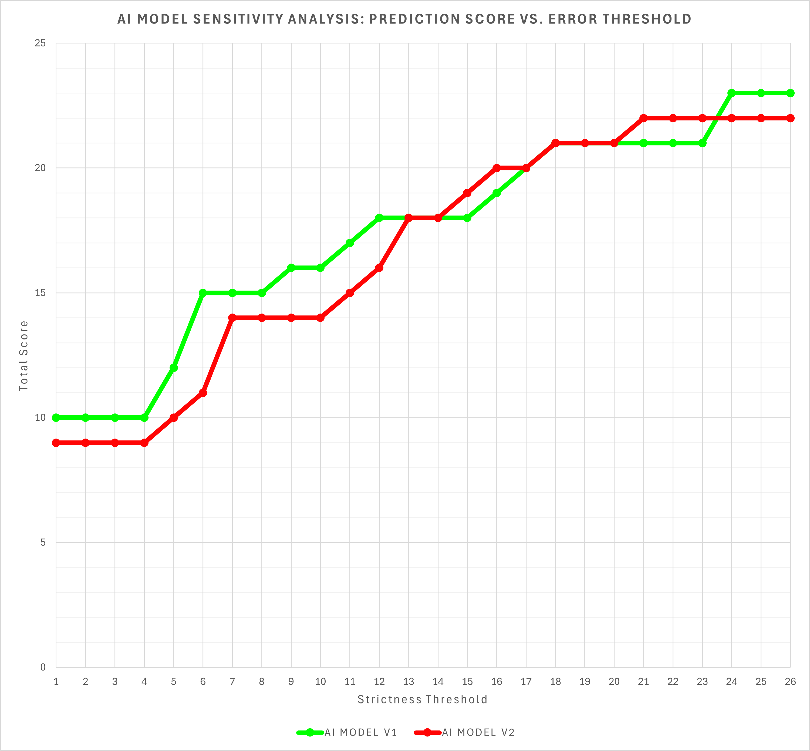
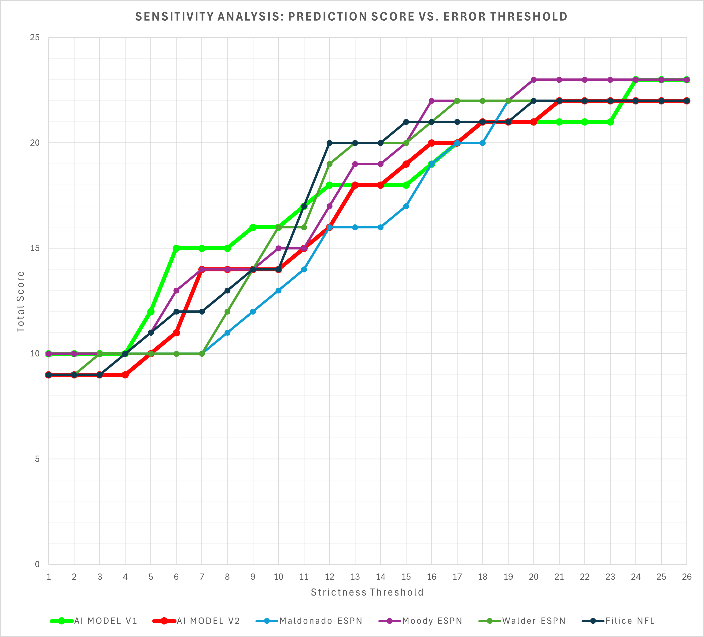
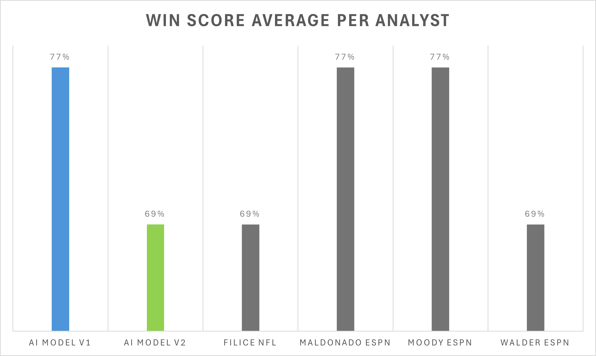
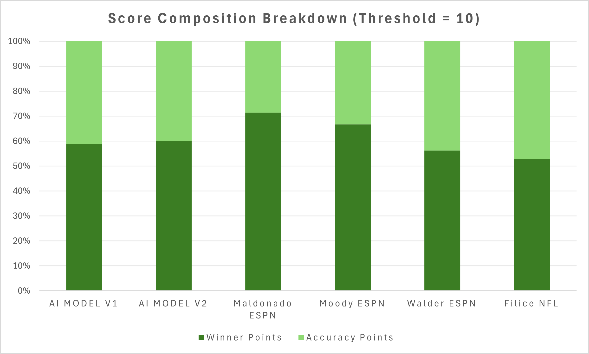
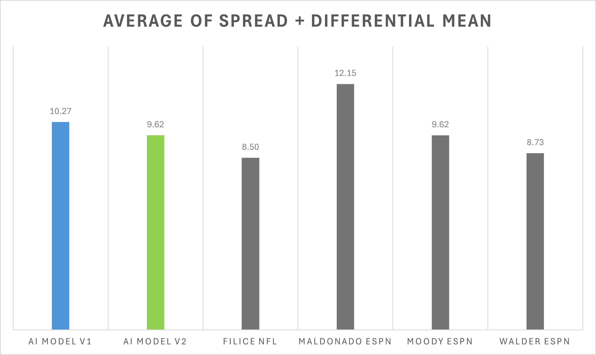

# NFL AI Prediction Engine (V2)

**An open-source AI model (Gemini 2.5 Flash-Lite) that predicts NFL scores using historical play-by-play data and advanced metrics.**

> **Current Status:** V2 (Analysis Complete - Proceeding to V3)
> **Base Model:** Google Gemini 2.5 Flash Lite (via Vertex AI)
> **Key Change:** Replaced "Points Per Game" inputs with "EPA/Play" and "Success Rate" from `nflfastr`.

---

## System Instructions

The following was entered into the System Instructions Section within the Vertex AI User Interface, before prompting the AI Model:

> You are an advanced NFL analytics engine trained on 25 years of NFLFASTR data (EPA, Success Rate, Dropback Efficiency).
>
>Your ONLY function is to analyze the provided "Advanced Pre-Game Stats" block and output a deterministic prediction.
>
> CRITICAL RULES:
> 1.  You are NOT a chat assistant. Do not speak to the user.
> 2.  You MUST NOT refuse a prediction. Do not say "games haven't been played" or "I cannot predict the future."
> 3.  You MUST NOT use outside knowledge. Base your prediction SOLELY on the math patterns from your training data.
> 4.  OUTPUT FORMAT: You must return ONLY the final string in this exact format: Winner: [TEAM], Final Score: [TEAM] [SCORE], [TEAM] [SCORE]
>
> Any deviation from this format is a system failure. Calculate and output the result.

---

## The Hypothesis: V1 vs. V2

This project is an iterative experiment in teaching an LLM to "understand" the American football game flow.

* **Model V1 (The Control):** Trained purely on **Points Per Game (PPG)** and Location. It learned simple, high-level scoring patterns.
* **Model V2 (The Experiment):** Trained on **Advanced Metrics** derived from the `nflfastr` dataset. Instead of looking at just points, V2 looks at efficiency:
    * **EPA/Play** (Expected Points Added Per Play)
    * **Success Rate %**
    * **Dropback & Rush Efficiency**

---

## Performance Analysis (Week 12 Results)

We benchmarked V2 against our V1 model and top ESPN/NFL analysts. The results provided a critical insight: **Efficiency metrics alone are insufficient without defensive context.**

### 1. Sensitivity Analysis: V1 vs. V2
We compared the robustness of both models across error thresholds (0-25 points).
* **Neon Green:** V1 Model (PPG-based)
* **Red:** V2 Model (EPA-based)

> **Observation:** Surprisingly, **V1 consistently outperformed V2.** The V1 model (Green) maintained a higher accuracy score across nearly every threshold. This suggests that while EPA is a "smarter" stat, the V2 model struggled to translate raw offensive efficiency into final scores without knowing the quality of the opposing defense.

### 2. Sensitivity Analysis: V2 vs. Human Analysts
How did the V2 model compare directly against human experts?

> **Observation:** The V2 model (Red) effectively ties with human analysts at lower thresholds but plateaus earlier. It lacks the "upside" accuracy that V1 demonstrated, likely because it cannot account for defensive matchups (e.g., a good offense facing an elite defense).

### 3. Win Score Analysis
Percentage of correct winner predictions for Week 12.

> **Observation:** V2 correctly predicted the winner in **69%** of matchups, slightly underperforming the top human analysts and v1 (77%). This regression from V2 indicates that offensive EPA alone may overstate a team's advantage if their defensive vulnerabilities are ignored.

### 4. Where the Points Come From (Score Composition)
We broke down the V2 performance to see if it was "lucky" or "precise."
* **Blue:** Points for Correct Winner.
* **Yellow:** Points for Precision (Error < 10 points).

> **Observation:** V2 struggled significantly with **precision** (the light green bar). While it could often pick the winner, its predicted final scores were frequently off by more than 10 points. This confirms that `Offensive EPA != Points Scored` is a complex relationship that requires more context to model accurately.

### 5. Average Error & Volatility
A comparison of the average combined error (Spread + Point Differential).
* **Lower Bar = Higher Precision.**

> **Observation:** V2 edged out V1, and was consistently on par with the ESPN and NFL Analysts. The model had more context about how each of these teams played the game of football, and was able to showcase that knowledge in this category. Without defensive knowledge, though, it struggled to correctly predict the winner for these matchups, making it tricky for it to get more points.

---

## The Conclusion & The Fix (V3)

**Conclusion:** "Smart" stats (EPA) are not automatically better than "Dumb" stats (PPG) if the context is incomplete. V2 failed because it was **"half-blind"**—it knew how good Team A was at scoring, but had zero data on how good Team B was at defending.

**The Fix for V3:**
We are currently building **V3**, which bridges this gap by introducing **Defensive Interaction Terms**:
1.  **Opponent Metrics:** Adding `Defensive EPA Allowed` and `Defensive Success Rate` to the training prompt.
2.  **Full Context:** The model will now see: *"Team A has a high Dropback EPA, BUT Team B has an elite Dropback EPA Allowed."*
3.  **Grounding:** Adding real-time injury report lookup to penalize efficiency stats for injured starters.

---

## Technical Architecture & Workflow

This project uses a modular Python pipeline to transform raw data into actionable AI predictions and performance metrics.

### 1. Data Ingestion & Engineering
* **Script:** `build_advanced_stats_db.py`
* **Function:** Connects to the **nflverse** repository and downloads play-by-play data for 1999–2025. It aggregates millions of raw plays into a structured CSV of game-level advanced stats (EPA/play, Success Rate).

### 2. Dataset Construction
* **Script:** `build_textbook_v2.py`
* **Function:** The core logic engine. It iterates through 7,000+ historical games, looks up the "rolling average" stats for each team *prior* to that game, and constructs the prompt/response pairs used for training.

### 3. Format Adaptation
* **Script:** `convert_to_vertex.py`
* **Function:** A custom adapter that transforms our raw JSONL dataset into the strict multi-turn chat format required by Google Vertex AI's fine-tuning API.

### 4. Model Fine-Tuning
* **Platform:** Google Vertex AI (Generative AI Studio)
* **Model:** **Gemini 2.5 Flash-Lite**
* **Process:** Supervised fine-tuning on 7,000+ examples to teach the model to act as a deterministic statistical engine rather than a conversational assistant.

### 5. Analysis & Visualization
* **Script:** `generate_week12_stats.py`
* **Function:** A post-processing script that ingests the model's predictions alongside ESPN analyst picks. It automatically calculates Win Rates, Sensitivity Scores, and Error Distributions, outputting the clean CSV data used to generate the performance graphs above.
