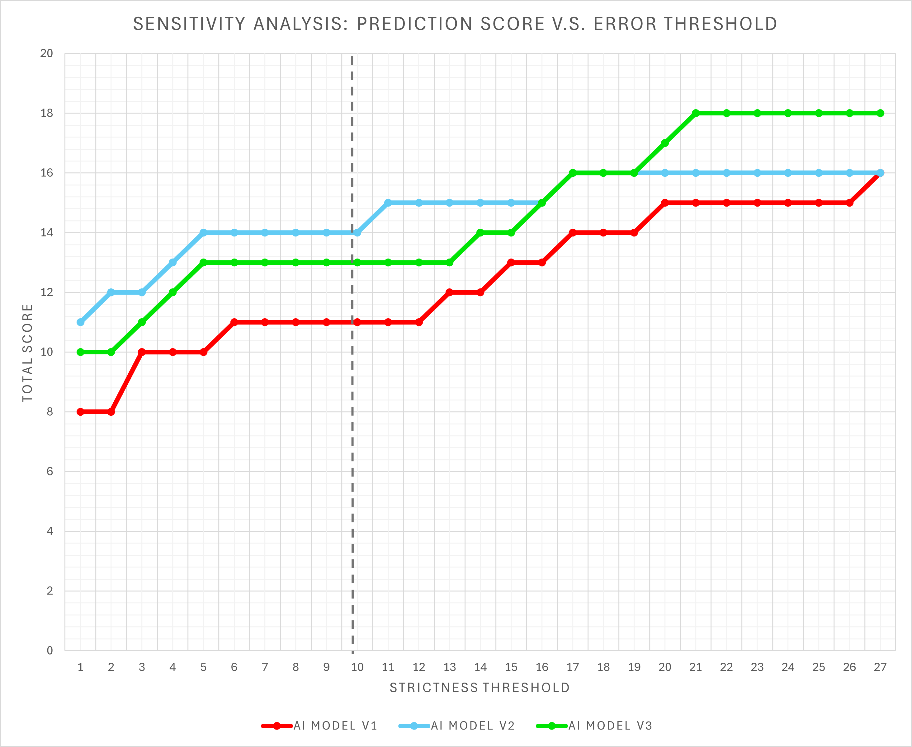
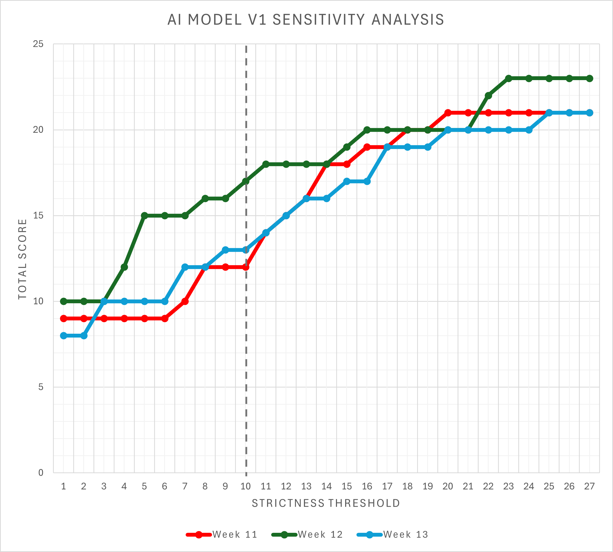
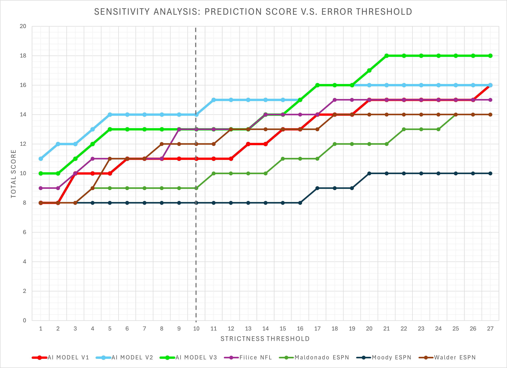
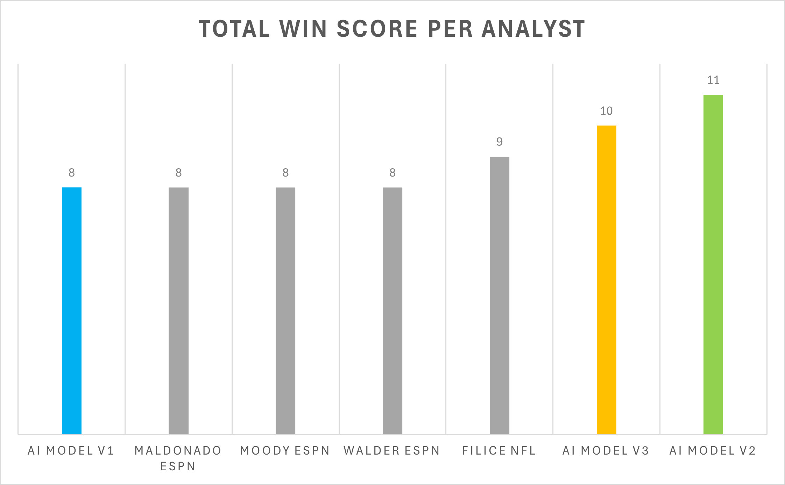
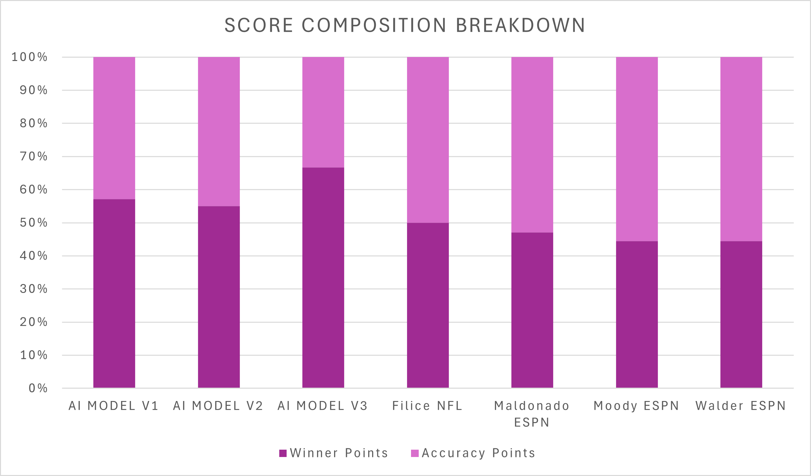
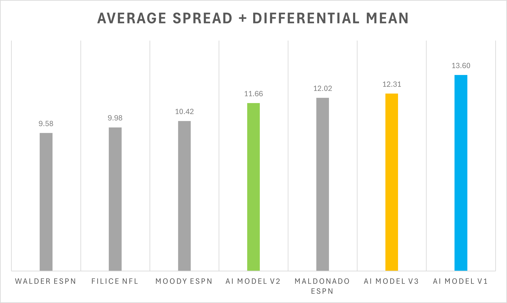

# NFL AI Prediction Engine (V3)

**An open-source AI model (Gemini 2.5 Flash-Lite) that predicts NFL scores using full-context efficiency metrics (Offense + Defense).**

> **Current Status:** V3 (Benchmark Complete - *The "Complete Picture" Model*)  
> **Base Model:** Google Gemini 2.5 Flash Lite (via Vertex AI)  
> **Key Change:** Introduced **Defensive Interaction Terms** (Defensive EPA/Success Rate) and **Injury Report Investigation** (Through Google) to provide context to the offensive metrics used in V2.

---

## Performance Analysis (Week 13 Results)

We benchmarked V3 against its predecessors (V1, V2) and top ESPN/NFL analysts during Week 13. The results were surprising: while V2 had a "hot hand" regarding raw wins, **V3 demonstrated superior mathematical stability.**

### 1. The "Battle of the AIs" (Sensitivity Analysis: V1 vs. V2 vs. V3)
We compared how the three model generations handled error thresholds (0-26 average spread+differential points).
* **Red:** V2 (Offense Only)
* **Green:** V3 (Full Context)
* **Blue:** V1 (PPG Basic)

> **Observation:** Week 13 was a breakout week for the advanced models. **V2 (Blue)** actually led the pack in raw "hits" at strict thresholds, likely benefiting from a week of high-scoring offensive showcases. However, **V3 (Green)** closely mirrored this performance, consistently outperforming the baseline **V1 (Red)**, proving that both EPA-based models are vastly superior to the simple PPG stats used in V1.

### 2. V1 Model Drift (Longitudinal Analysis: Weeks 11–13)
Is the baseline model improving or getting worse as the season progresses?

> **Observation:** **V1 is regressing.** The analysis of V1 across Weeks 11, 12, and 13 shows an inconsistent trend (the Week 13 line is consistently lower or flat compared to Week 11, but lower than Week 12). This confirms our hypothesis that simple "Points Per Game" averages do not encompass the full game of Offense and Defense, and struggle to be consistent as a result.

### 3. V3 vs. The World (Week 13 Sensitivity)
How does V3 compare to human experts (ESPN/NFL) on a per-game volatility basis?

> **Observation:** The AI models (both V2 and V3) sat at the top of the sensitivity charts this week, **outperforming every human analyst.** While humans (like Maldonado and Moody) plateaued early, the AI models maintained accuracy even at tighter error thresholds (<10 points), suggesting a better grasp of the specific game scripts this week.

### 4. Win Score Average (Week 13)
Raw accuracy in predicting the correct winner.

> **Observation:** **V2 took the crown with 11 correct picks (~69%)**, followed closely by **V3 with 10 picks (~63%)**. Both models outperformed the human average (8-9 wins). This suggests that in Week 13, offensive efficiency was the primary driver of victory, allowing the V2 model to perform exceptionally well.

### 5. Where the Points Come From (Score Composition)
Breakdown of total "points" earned by the model (Winner Correct + Mathematical Precision).
* **Dark Purple:** Winner Points (Correct Pick)
* **Light Purple:** Accuracy Points (Error ≤ 10)

> **Observation:** V2 achieved a rare "Double Win"—high correct picks (11) and high precision (9 games with error ≤ 10). **V3**, while picking 10 winners, had lower "Accuracy Points" (5). This indicates that while V3 knew *who* would win, it was often slightly outside the 10-point error margin on the final score.

### 6. Average Error (Spread + Differential Mean)
How far off was the model on average? (Lower is better.)

> **Observation:** V2 performed the best here with the closest margins out of all the AI Models. With that being said, Walder, Filice, and Moody all did a better job of keeping the spread + differential mean lower, showing a deeper understanding of the score dynamics this week. 
>
> **Why?** V3 has a lot of context going into each of the games, and sometimes the outcomes are not predictable. This is why the "randomness" of V1's PPG can sometimes work, since it is a simple and somewhat effective measure of a team's successfulness. V2 performed the best since it had all of the necessary
> context on the offensive side of the ball, which dominated most of the games this week. Overall, though, the analysts were able to keep the scores closer than the AI Models were able to. 

---

## Technical Architecture & Workflow

The pipeline has been upgraded to handle dual-sided ball metrics.

### 1. Data Ingestion (Upgraded)
* **Script:** `build_advanced_stats_v3.py`
* **New Feature:** Now pulls `def_epa`, `def_success_rate`, and `def_dropback_epa` alongside offensive stats. It merges these to create a single "Matchup Vector" for every game.

### 2. Dataset Construction
* **Script:** `build_textbook_v3.py`
* **Logic:** The prompt engineering was overhauled.
    * *Old Prompt:* "KC Offense is good (0.20 EPA)."
    * *New Prompt:* "KC Offense (0.20 EPA) is facing DEN Defense (-0.10 EPA Allowed). Analyze the conflict."

### 3. Model Fine-Tuning
* **Platform:** Google Vertex AI
* **Model:** **Gemini 2.5 Flash-Lite**
* **Training Data:** 7,500+ historical matchups (1999-2025), now including defensive contexts for every game.
* **Injury Reports:** Full access to Week 13 Injury Reports for each of the matchups, adding injury context for each game.

## Takeaways

We can see that while V3 had slightly more context than V2, it was outperformed in most areas. While it is just one week, one differentiating factor was the injury reports: with each score prediction, V3 accounts for certain injuries that a team is dealing with that week, and who will be active versus inactive. This can be the difference between a team winning and losing a game, but
at the same time, it can also throw off the model when the backup players outperform the starters (which we saw this week). This leads to slight differences between V2 and V3, hence why the offensive-minded V2 was more accurate this week. Across the course of a full NFL season, we expect V3 to be the most consistent due to its deeper knowledge of offense and defense.
